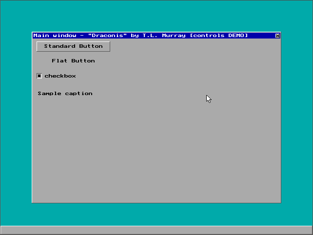

# DOS Graphical User Interface #1

### About:
A graphical user interface, similar to Windows, for DOS.

### Instructions:
Run "draconis.exe". Click the "x" to close the main window to quit.

**DOSBox config:** Should just work, may need to press CTRL+F10 to get the mouse cursor working.

### Screenshot:

### Info:
**Created:** 2001

**Operating System:** DOS 6

**Compile with:** Borland Turbo C++ 3.x (make sure your "Options" -> "Directories" paths for "Libraries" and "Includes" are correct)
